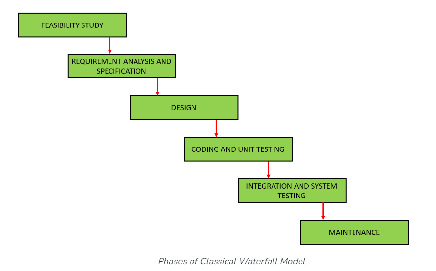
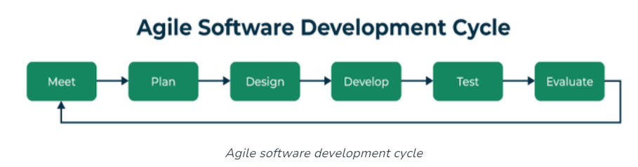

# Project & Introduction to Software Engineering

2023/12/27 (BeiJing Time)

---

## What is Software Engineering?
Software Engineering is the process of 
- **designing**: requirements, architecture, and components
- **developing**: implementation, make the designing to codes
- **testing**: test bugs and fix them
- **maintaining**: maintain the software

---

## Main Attributes of Software Engineering
- **Efficiency**:It provides a measure of the resource requirement of a software product in an efficient way.
- **Reliability**:Will deliver the same results when used in similar working environment.
- **Reusability**:This attribute makes sure that the module can be used in multiple applications.
- **Maintainability**:It is the ability of the software to be modified, repaired, or enhanced easily with changing requirements.

---

# Software Engineering 【Trade Off】
- time
- cost
- quality
- scope
- risk

---

## Life Cycle Models
- **Waterfall Model**: The waterfall model is a software development model used in the context of large, complex projects, typically in the field of information technology. It is characterized by a structured, sequential approach to project management and software development.

---
### Waterfall Model

---

## When to Use the Classical Waterfall Model
- Only well-defined, unambiguous, and fixed requirements are employed with this paradigm.
- The definition of a product is constant.People understand technology.
- There are no unclear prerequisites.
- There are many resources with the necessary knowledge readily available.
- When it’s a brief project.

---

## Life Cycle Models
- **Agile Model**: Agile Software Development is an iterative and incremental approach to software development that emphasizes the importance of delivering a working product quickly and frequently. It involves close collaboration between the development team and the customer to ensure that the product meets their needs and expectations.

---

---

## Agile Model

---

## Agile Model

We use the Agile Model to finish our project.

