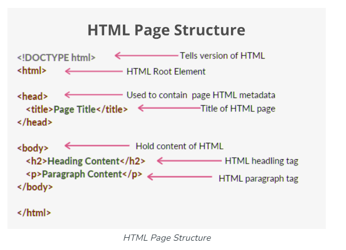

# Frontend
- HTML : Structure
- CSS : Style 
- JS : Logic

---

# HTML

---

## What is HTML?
HTML stands for `HyperText Markup Language`. 

---



---

## The tags in HTML

- button
- div

---

# CSS

`CSS (Cascading Style Sheets)` is used to style web pages. 

---

## Type of CSS

- **Inline**: Inline CSS contains the CSS property in the body section attached to the element.

```html
<p style="color: red;font-size: large;">$100</p>
```

---
- **Internal or Embedded**: The CSS ruleset should be within the HTML file in the head section i.e. the CSS is embedded within the HTML file.

```html
<html>
  <head>
    <title>Book Store</title>
    <style>
      p {
        color: red;
        font-size: large;
      }
    </style>
  </head>

  <body>
    <div>
      
      <h2>Book1</h2>
      <p>$100</p>
      <p>testAuthor</p>
    </div>

  </body>
</html>
```

---
- **External**: External CSS contains a separate CSS file that contains only style properties with the help of tag attributes.


---

## Example of CardView
```html
<body>
  <div style="border: 1px solid #ccc;width: fit-content;">
    
    <h2 align="center">Book1</h2>
    <p style="color: red;font-size: large;margin-left: 10%;">$100</p>
  </div>
</body>
```

---
## Example of CardView

