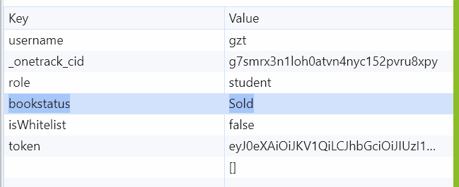
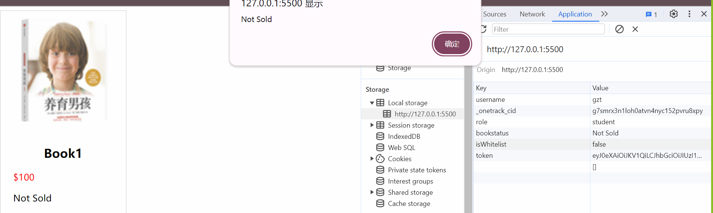

# Lecture 4: Web Storage

---

# Requirements

- Record the info of our users
  - if the book is sold
- If we refresh the page, the info should be kept

> key value storage
> - key: book status
> - value: sold/not sold

---

# Web Storage

## Local Storage
- stores data with no expiration date

## Session Storage
- stores data for one session (data is lost when the browser tab is closed)

---

# Local Storage

## Store data

```js
localStorage.setItem("bookstatus", "Sold");
```



---

# Local Storage

## Get data

```js
localStorage.getItem("bookstatus");
```


---

# Homework

- Add the book price to the local storage
- Display the book price on the page
- Try to find all the key-value in your local storage