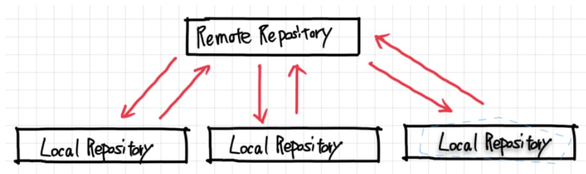

# Lecture 6: Git and GitHub

---

## Git

Git is a widely used `distributed version control `and source code management system

---

## Using Git

- First, make a copy of the file or other files in a storage location that can be shared by everyone (from now on referred to as "remote repository") on your computer (from now on referred to as "local repository"), and then add or edit new code or files.
- Then, the files will be updated by registering them from the local repository to the remote repository.

---

## Repositories
A repository in Git is a storage for files, which can be remote or local.

- Remote Repository is a repository where the source code is placed on a server on the Internet and can be shared by everyone.
- Local repository is a repository where the source code is located on your computer and only you can make changes.

---

## Workflow of Git

1. Copy and bring the files from the remote repository.
2. Changes to the source code are made through the working directory.
3. Upload the changes to the remote repository.

---

## Git Command

- `git clone` : Copy the remote repository to the local repository.
- `git push` : Upload the changes to the remote repository.
- `git pull` : Copy the changes from the remote repository to the local repository.

- `git add` : Add the file to the staging area.
- `git commit` : Save the changes to the local repository.

---

## HomeWork:

- Understand the basic concepts of Git.
  - What is a repository? //a place to store code
  - What is a remote repository? //your private code space
  - What is a local repository? //public code space that you can upload and retrieve code from
- How to use Git (book_store)?
- Understand the basic commands of Git.
  - `git clone` //duplicate
  - `git push`  //upload
  - `git pull`  //retrieve

